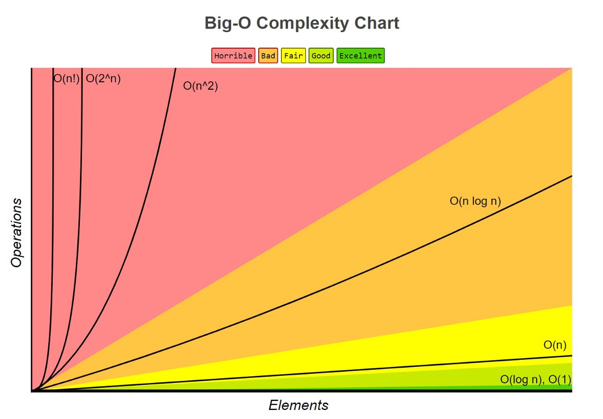
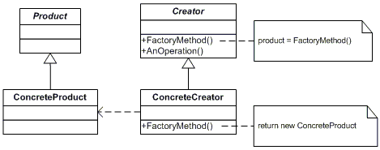

[CARRERA: PROGRAMADOR ++ ](https://openwebinars.net/academia/carrera/programador-cpp/)

OpenWebinars 

1.	INTRODUCCIÓN A LA PROGRAMACIÓN
2.	INTRODUCCIÓN A LAS ESTRUCTURAS DE DATOS
3.	SOLID Y PATRONES DE DISEÑO
4.	INTRODUCCIÓN A C++
5.	CURSO DE GIT
6.	PROGRAMACIÓN ORIENTADA A OBJETOS CON C++
7.	PROGRAMACIÓN GENÉRICA Y CONCURRENTE
8.	PATRONES E INTERFACES EN C++

***

#### 1.	INTRODUCCIÓN A LA PROGRAMACIÓN ####

**20/04/2021**

-	Fundamentos de la programación estructurada. 
-	Ciclo de desarrollo de una aplicación: análisis, diseño y codificación.

**21/04/2021**

-	Diseño de algoritmos con pseudocódigo. 
-	Entorno de trabajo: PseInt, para escribir pseudocódigo y ejecutarlo.
-	Introducción a los lenguajes de programación. Traductores.
    - Compiladores (ejemplo con C++)
    - Intérpretes (ejemplo con Python)
    - Máquina Virtual (ejemplo con Java)

El curso incluye varias hojas de ejercicios para realizar con pseudocódigo e 
introducirse en la práctica de entrada y salida de información, estructuras 
alternativas y repetitivas, arrays y funciones y procedimientos. 
Dado que son ejercicios muy sencillos  (y muchos ya están subidos en los 
primeros repositorios que he subido aquí), no los haré pero subiré los enunciados.

---
#### 2. INTRODUCCIÓN A LAS ESTRUCTURAS DE DATOS ####

**22/04/2021**

Estructuras de datos en Java  

- Análisis de algoritmos
    - Cómo medir la velocidad de un algoritmo --> Análisis de las instrucciones del algoritmo en base a los datos con los que está trabajando.
    - Notación Big O o crecimiento de funciones: nos indica qué tan rápido es un algoritmo,   
    No tiene en cuenta los coeficientes (desviaciones), sólo el factor dominante (elemento que más crece).

        ***O(n)** siendo n el número de elementos* 

        

- Estructuras de datos
    - Es una forma de organizar una colección de datos en una computadora para que puedan ser utilizados de manera eficiente.  
    Colección de datos relacionados y preparados que permite ciertas operaciones para ese conjunto, permitiéndonos poder hacer algoritmos de una forma más eficiente y segura.  
        - Arrays, listas ligadas, colas, pilas, montículos.

- Datos primitivos y compuestos
    - Primitivos: Booleanos, caracteres, enteros, números de punto flotante, punteros.
    - Compuestos: Registros u objetos, string, array 
          
- Tipos de datos genéricos

        public class ListaGenerica <T>{

            private ArrayList<T> lista = new ArrayList<T>();

            public ListaGenerica() {}

            public T get(int index) {
                return lista.remove(index);
            }

            public void delete(int index) {
                lista.remove(index);
            }

            public void add(T integer) {
                lista.add(integer);
            }

            public int size() {
                return lista.size();
            }

        }

    Se especifca el tipo de dato a través de <>
         
        public class Pareja<K,V> {

            private K key;
            private V value;
    
            public Pareja(K key, V value) {
                this.key = key;
                this.value = value;
            }

            public K getKey() {
                return key;
            }

            public void setKey(K key) {
                this.key = key;
            }

            public V getValue() {
                return value;
            }

            public void setValue(V value) {
                this.value = value;
            }
        }

    También podríamos decir que el tipo de dato usado en valores sean solo aquellos que extienden de la interfaz Usuarios, evitando así, que podamos usar cualquier otro tipo de dato

        public class Pareja<K, V extends Usuarios> { } 
 
- Tipos de datos abstractos (TAD ó ADT)
 
    Modelo matemático para definir tipos de datos, con un comportamiento esperado. En Java normalmente se escriben en interfaces.

        public interface Pila<T>{
            void push(T t)

            void T pop()

            void T peek()

            boolean isEmpty()

            int size()
        }

    Ejemplos:  montículo, el árbol, o la pila, ...  Se implementan con arrays (una estructura de datos para implementar un ADT de una lista por ejemplo).
    Según como se implementen, podrán tener un coste mayor o menor.

**23/04/2021**

  - Arrays estáticos 
    - Almacena de forma contigua los valores en la memoria.
    - Rellena todas las posiciones con un valor por defecto (int con 0, objetos con null, ...) definidos por Java
    - ADT (operaciones):
        - Crear(tamaño)
            - Coste O(N). Recorre cada posición de la memoria con el valor por defecto
        - EstablecerValorEn(valor, posición)
            - Coste O(1)  
        - Obtener(posición)
            -  A través de la posición de memoria donde empieza el array, y el tamaño de cada objeto, accede a la posición
            -  Coste O(1) 
        - Búsqueda
            - Coste O(N), porque en el peor caso estará en la última posición
        - Ordenar 
            - Coste O(NLogN)
            - Arrays.sort(array)
        - Búsqueda (en array ordenado)
            - Coste O(LogN) 
            - Arrays.binarySearch(array, key)            
        - Copiar un rango     
            - Arrays.copyOfRange(array, desde incluido, hasta no incluido)             
            - Coste O(N), en el peor caso copia todas las posiciones
             

-  Arrays dinámicos (ArrayList)
    - Son un envoltorio a un array estático, y hace operaciones sobre este para modificar su tamaño de forma óptima.     
      Internamente son una serie de operaciones para crear y borrar (copia) arrays estáticos en base a nuestras operaciones       
    - ADT
        - Crear()
            - Por defecto, array vacío con capacidad de 10. Coste: O(N)
        - Agregar(elemento)
            - Primero asegura capacidad interna del array. Si sobrepasa, crea un nuevo array con mayor capacidad (+/- el doble) en el que copia todos los elementos del viejo.
            - Amortizar coste de inserción -> O(1) = establecer
            - Coste O(N) en el peor caso
        - Agregar(elemento, posición)
            - Coste O(N) en el peor caso, insertando en 0
        - Borrar(posición)
            - Coste O(N) igual que el caso anterior
        - Obtener(posición)
            - Coste O(1) = estáticos
        - Establecer(elemento, posición)
            - Coste O(1)
          
  
- Listas ligadas 
    - Es una forma de crear una lista con los datos, de tal manera que un dato está enlazado con el siguiente. 
    - Datos no contiguos. Guarda dato y la referencia (enlace) al siguiente en una posición de memoria.
    - Clase Nodo genérica con Dato y Nodo al Siguiente
    - Nodo principio apuntando a Nodo A y un final apuntando al Nodo final (Siguiente = Null)
    - ADT:
        - Insertar al principio
            - Coste O(1) ---> Nuevo Nodo B -> B.siguiente = Principio -> Principio = B
        - Insertar al final
            - Coste O(1) con lista vacía --> Nuevo Nodo A -> Principio y Final apuntando a A
            - Coste O(1) en lista con objetos --> Nuevo Nodo B -> Final.sig = B -> Final = B
        - Insertar en posición
            - Coste: O(N)
               - Nuevo Nodo, sig = null
               - Recorrer lista con dos nodos: Anterior mantendrá nodo anterior y Actual en nodo que se está comprobando si es el buscado
               - Anterior.sig = Nuevo
               - Nuevo.sig = Actual 
        - Eliminar al principio 
            - Coste O(1) ---> Principio = Nodo A.sig
        - Eliminar en posición o al final
            - Coste O(N) ---> igual que Insertar en posición -> Anterior.sig = Actual.sig
        - Obtener elemento del principio
            - Coste O(1)
        - Obtener elemento del final
            - Coste O(1)
        - Acceso a posición
            - Coste O(N) -> Recorrer al menos todo. Posición de memoria desconocida
 
    - Lista ligada doble
        - Cada Nodo tiene dos enlaces, al siguiente y al anterior.
        - No necesario Nodo Anterior y Actual para operar.           
        En Java -> clase LinkedList    

- Pilas (Stack)
    - LIFO (Last in, Last out)
    - Implementar acción deshacer (apilando acciones) o búsqueda en profundidad 
    - Guardar llamadas de las funciones recursivas en el orden en que se deben ejecutar.
    - ADT: Crear, Apilar (push), Desapilar (pop), Ver la cima, Tamaño, Ver si está vacía

    - Implementar pila con lista ligada. ADT:
          - Apilar/Desapilar -- Insertar/Eliminar (SE QUITA) al principio. Coste O(1)
          - Ver la cima Coste O(1)

    - Implementar pila con array dinámico
          - Cima variable top inicializada a -1
          - Apilar: top++ --> Insertar elemento en top. Coste O(1)
          - Desapilar: top--  Coste O(1)
          - Ver la cima con top. Coste O(1)

- Colas(Queue)
    - FIFO (First in, First Out)
    - Transferir datos entre procesos asíncronos, cola de entrada para servidor, búsqueda de anchura...
    - ADT: crear, encolar, desencolar, "" = pila
     
    - Implementar cola con lista ligada. 
        - Encolar -- Insertar al final. Coste O(1)
        - Desencolar -- Eliminar (SE QUITA) al inicio. Coste O(1)
        - Ver al frente con top. 1er elemento lista. Coste O(1)
 

- Montículos
    - Retiramos valores de forma ordenada (el array no debe estar necesariamente ordenado) con un coste bajo
    - Es un tipo de árbol binario, tiene un nodo y este dos hijos (puede ser altura n)
    - Dos tipos: max (orden mayor a menor, padre > hijos) y min (p < h)
    - Ha de rellenarse de izq a der sin dejar ningún nodo en medio sin hijos
    - Implementar algoritmo de Prim, de Dijkstra, lista ordenada de inserción muy rápida y eficiente
    - ADT de una implementación cola de prioridad:
        - Crear: array dinámico
        - Insertar elem: última pos array. Método flotar -> mover elem a pos correspondiente
            Acceder a padre a O(1) -> si k>0, padre está en pos (k-1)/2 
            Nodos = 2^(altura+1)- 1 == Altura = Log2(Nodos) --> Altura = Log2(lista.size) --> Coste O(LogN)
        - Retirar elemento max/min: quitamos 1er elem, el último se coloca en la 1a pos y usamos método hundir: comprobación con hijos más peq/may -> (2*k)+1 hijo izq, (2*k)+2 hijo der --> O(LogN)  
    
    - HeapSort: algoritmo de ordenamiento que se basa simplemente en ir retirando todos los elementos de un montículo (heap) e irlo insertando por ese orden en el array
        - Coste O(NLogN)

**Bibliografía recomendada:**
- SedGewick R., Wayne K. Algorithms     
- Lewis, Chase. Java Software Structures. Designing and Using Data Structures
- Bhargava, A. Grokking algorithms

---
#### 3. SOLID Y PATRONES DE DISEÑO ####

En C#

**24/04/2021**

Objetivos curso: Conocer buenas prácticas de programación, generar código escalable, limpio y de calidad y código más mantenible  
Diseño orientado a objetos

Problemas diseño app: demasiadas funcionalidades sin relación en una clase (poco encapsulado), demasiada interrelación/dependencia entre clases (estrechamente acopladas), código duplicado  
Soluciones: elección arquitectura, principios de diseño, patrones de diseño  
Objetivo: Disminuir costes de mantenimiento. Poder añadir/modificar funcionalidades más fácilmente. C´p

- **SOLID** -> Principios base a seguir antes de proponer una arquitectura de software. Código escalable a un futuro. Alta cohesión y bajo acoplamiento (menor dependencia, mejor especificación propositos sistema)
    - Alta cohesión: Información de una clase coherente, estar relacionada con la clase
    - Bajo acoplamiento: Clases menos ligadas entre si. En caso de modificación, menor repercusión posible en el resto. + Reutilización - Dependencia 
     
    - **S**: Single Responsability Principle (SRP) 
        - "Cada módulo de software debe tener una sola razón para cambiar." Cada clase debe tener un único trabajo/proposito.  
        - 
    - **O**: Open/Closed Principle (OCP)
        - Un módulo/clase está abierto para extensión y cerrado para modificación. Si queremos añadir funcionalidades nuevo lo ideal sería poder construir sobre lo que ya existe (sin modificaciones grandes). No alterar a menos que haya errores.  
            Extensiones --> Interfaces/Clases abstractas -> Posibles arreglos para clases que las implementen  

    - **L**: Liskov substitution Principle (LSP)
        - "Si S es un subtipo de T, entonces los objetos de tipo T en un programa de computadora pueden ser sustituidos por objetos de tipo S (es decir, los objetos de tipo S pueden sustituir objetos de tipo T ), sin alterar ninguna de las propiedades deseables de ese programa (la corrección, la tarea que realiza, etc.)" Wikipedia   
        - Establece que debería poder usarse una clase derivada en lugar de la clase ppal y con mismo comportamiento sin modificaciones.
             Derivada no afecte comportamiento de la ppal. Clase derivada debe ser sustituible por su clase base. 
        - Extensión de ppio OCP: Clases derivadas amplíen clases base sin modificar su comportamiento.  
                 
    - **I**: Interface Segregation Principle (ISP)
        - "Los clientes no deben ser forzados a implementar interfaces que no usan. En lugar de una sola interfaz, se prefieren muchas interfaces pequeñas basadas en grupos de métodos (muy relacionados, alta cohesión), cada uno de los cuales sirve a un submódulo."  
             Una interfaz debe estar más relacionada con el código que la usa (del cliente) que con el código que la implementa (la clase).  
             Cada interfaz debe de tener un propósito/responsabilidad único (ppio SRP)                              

    - **D**: Dependency Inversion Principle (DIP)
        - Los módulos de alto nivel no deben depender de módulos de bajo nivel (+ op. detalladas), si no de abstracciones.  
        - Las abstracciones no deben depender de los detalles. Los detalles deben depender de las abstracciones.  
        - Patrones que ayuden a abstraer nuestros módulos.  
        - Inyeccion de dependencia (inversión de control).   
        - Evitar acoplamiento entre alto-bajo nivel(cambios de una clase pueden romper otra) --> Hacer que dependan de abstracciones
        
    Objetivo ppios SOLID: Código ordenado, legible y fácil de mantener. El código puede ser que aumente de tamaño, pero será de mejor calidad.
    Respetando estos principios se han desarrollado los patrones creacionales, estructurales y de comportamiento. 

- Principios de diseño de software
    - You Aren't Gonna Need It (YAGNI) -Haz la cosa más simple que pueda funcionar-, Keep it simple, Stupid! (KISS), Don't Repeat Yourself (DRY) / Duplication Is Evil (DIE)
    - Ley de Demeter -> "Habla solo con tus amigos cercanos. No hables con extraños." Un método de un objeto sólo puede llamar a métodos del propio objeto, sus argumentos, objetos del método y propiedades del objeto.
        - Mecanismo de detección de acoplamiento (problema de arquitectura). Encapsulamiento clases. 

    - MoSCoW: técnica de priorización de requisitos basada en el hecho de que aunque todos los requisitos se consideren importantes es fundamental destacar aquellos que permiten darle un mayor valor al sistema, lo que permite enfocar los trabajos de manera más eficiente  
         M(Must) S(Should) C(Could) W(Won´t)  -> Esta clasificación puede ser modificada durante el proceso de desarrollo y definirse, en el caso de desarrollos iterativos incrementales, prioridades a nivel de iteración.

- **Patrones de diseño**: forma reutilizable de resolver un problema común (estructura de clases)  
Ahorro de tiempo. Validez de código. Uso de lenguaje común. Aplicaciones robustas, facilitan mantenimiento. Nos ayudan a cumplir muchos ppios SOLID, control de cohesión, acoplamiento, reutilizar código...   

Bibliografía: Design Patterns. Gang of Four    

Objetivos: catálogos de elementos reusables, evitar la reiteración en la búsqueda de soluciones a problemas ya conocidos y solucionados, vocabulario común entre diseñadores, Estandarizar el modo en que se realiza el diseño, facilitar el aprendizaje  
No -> Imponer ciertas alternativas de diseño frente a otras.

1. Patrones creacionales -> Creación de instancia. Encapsular y extraer dicha creación.  
    -  **Abstract Factory** (Frecuencia de uso: Alta)
         - Interfaz para crear familias de objetos relacionados o dependientes sin especificar sus clases concretas (sin especificarse directamente).  
         
        [Plantilla Estructura](https://github.com/cdiazal/SOLID_Patterns/tree/master/Patterns/Creational%20Patterns/GangOfFour.Abstract.Structural)  

           

        [Ejemplo](https://github.com/cdiazal/SOLID_Patterns/tree/master/Patterns/Creational%20Patterns/GangOfFour.Abstract.RealWorld)

        *Creación de jerarquía paralela de objetos y abstracción de la creación de objetos- No se crean todas las clases dentro de Cliente.*                 

    -  **Builder** (Frecuencia de uso: Media baja)
        - Separa la construcción de un objeto complejo de su representación para que el mismo proceso de construcción pueda crear diferentes representaciones.  
         
         [Código Estructural](https://github.com/cdiazal/SOLID_Patterns/tree/master/Patterns/Creational%20Patterns/GangOfFour.Builder.Structural)

         

          [Ejemplo](https://github.com/cdiazal/SOLID_Patterns/tree/master/Patterns/Creational%20Patterns/GangOfFour.Factory.RealWorld)

    - **Factory Method** (Frecuencia de uso: Alta)
        - Define una interfaz para crear un objeto, pero deja que las subclases decidan de qué clase crear una instancia. Factory Method permite que una clase difiera la creación de instancias a subclases.
        - Flexibilidad para crear diferentes objetos. Va a haber una clase abstracta que puede proporcionar un obj predeterminado, pero cada subclase va a crear una instancia de una versión extendida del obj.
         
        [Código Estructural](https://github.com/cdiazal/SOLID_Patterns/tree/master/Patterns/Creational%20Patterns/GangOfFour.Factory.Structura)

        
        
        [Ejemplo](https://github.com/cdiazal/SOLID_Patterns/tree/master/Patterns/Creational%20Patterns/GangOfFour.Factory.RealWorld)
         
    - **Prototype** (Frecuencia de uso: Media)
        - Especifica el tipo de objetos para crear utilizando una instancia prototípica (obj existentes del mismo tipo) y crea nuevos objetos copiando este prototipo.  
        
        [Código Estructural](https://github.com/cdiazal/SOLID_Patterns/tree/master/Patterns/Creational%20Patterns/GangOfFour.Prototype.Structura)  

          

        [Ejemplo](https://github.com/cdiazal/SOLID_Patterns/tree/master/Patterns/Creational%20Patterns/GangOfFour.Prototype.RealWorld)  
 
    - **Singleton**  (Frecuencia de uso: Media alta)
        - Se asegura de que una clase tenga solo una instancia y proporciona un punto global de acceso a ella.
        
        [Código Estructural](https://github.com/cdiazal/SOLID_Patterns/tree/master/Patterns/Creational%20Patterns/GangOfFour.Singleton.Structural)
        
        

        [Ejemplo](https://github.com/cdiazal/SOLID_Patterns/tree/master/Patterns/Creational%20Patterns/GangOfFour.Singleton.RealWorld)

2. Patrones estructurales -> Cómo utilizar estructuras de datos complejas a partir de datos más simples. Crear interconexión entre objetos y que éstas relaciones no se vean afectadas por cambios en los requisitos del prog.
  
3. Patrones de comportamiento -> Especifican el comportamiento entre objetos del prog. Interacción y responsabilidades entre clases y objetos, y gestión de algoritmos que la encapsulan.
